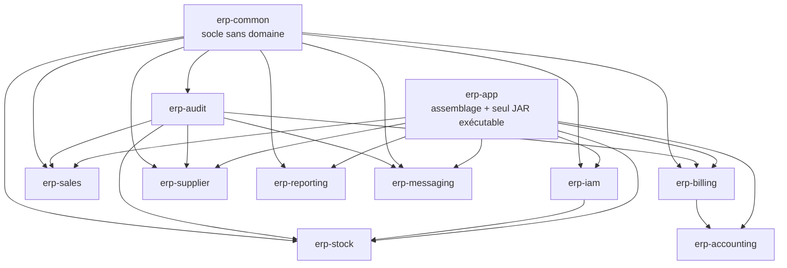
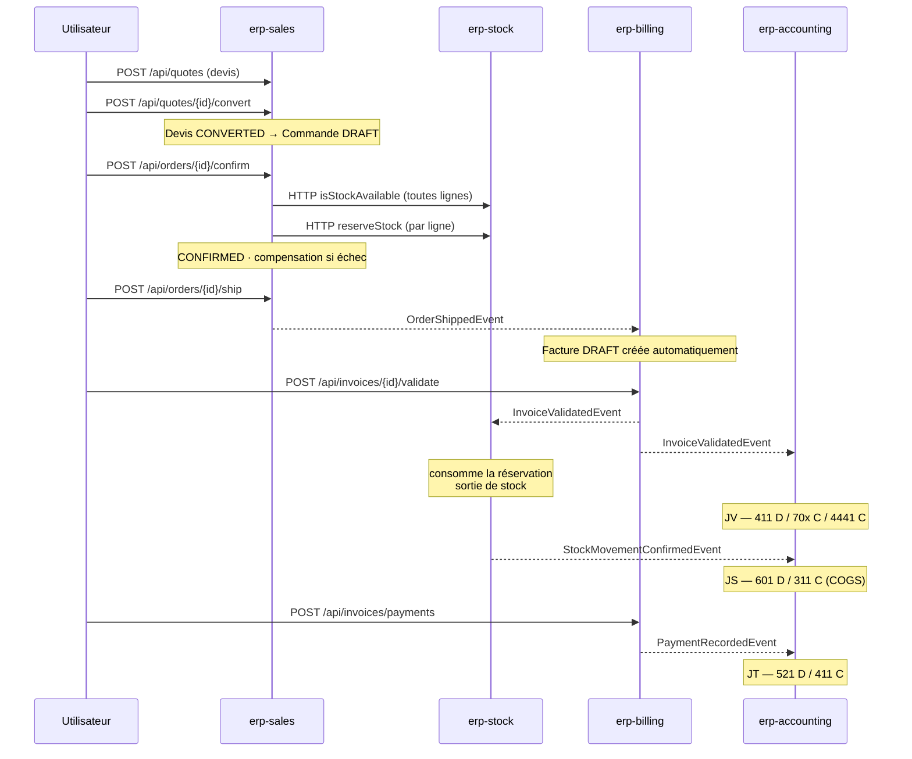
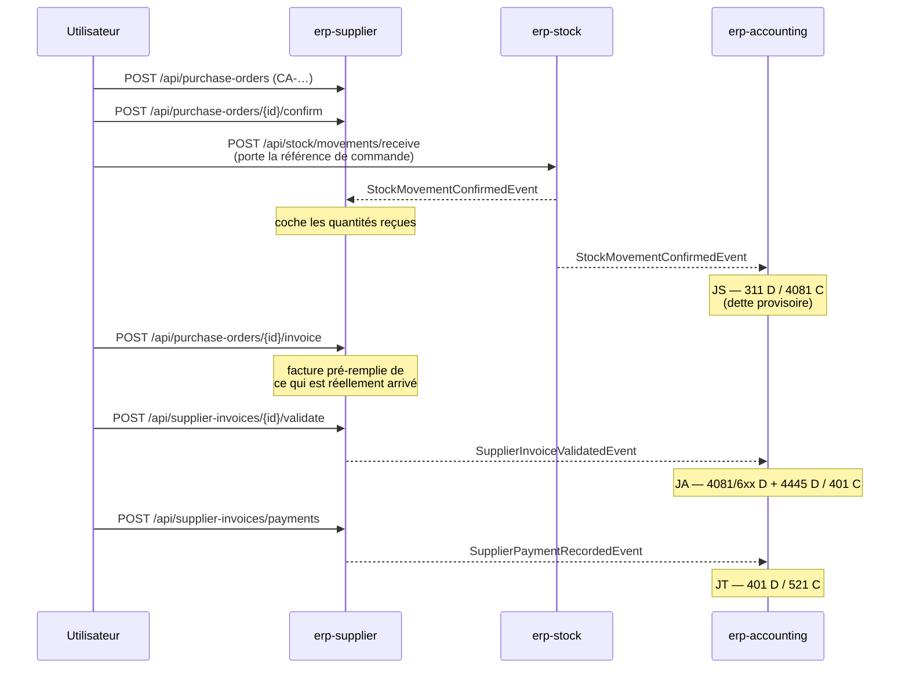
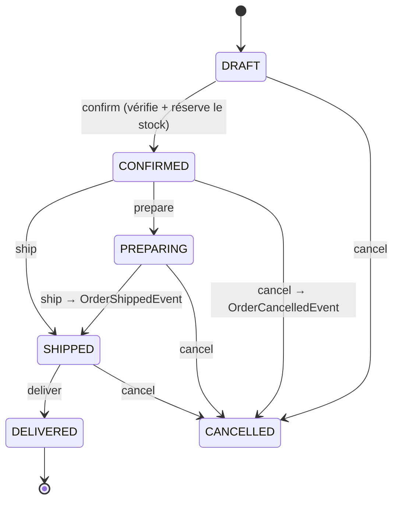
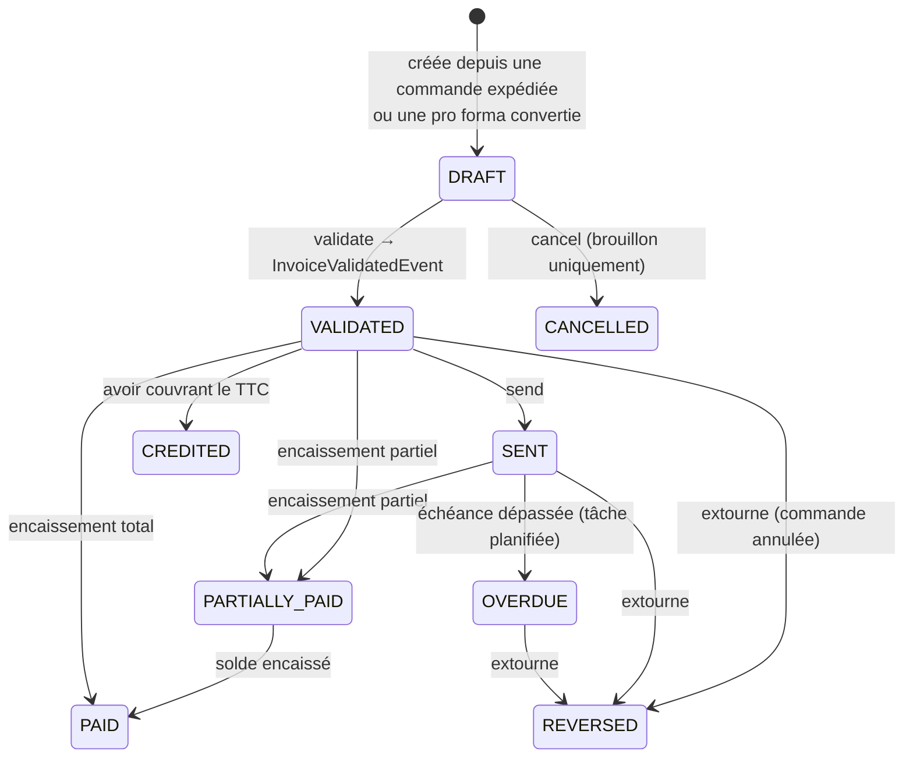
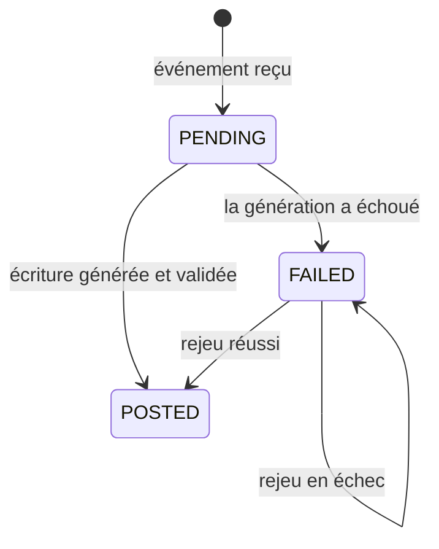

# Modules, comportements et flux d'opération

Documentation fonctionnelle et technique de `com.kit.erp:erp-parent` — monolithe
modulaire Spring Boot 3.3 / Java 21, contexte comptable OHADA.

**Établi le 2026-08-04 par lecture du code**, pas de la documentation existante.
Les 196 points d'entrée et leurs permissions sont extraits des contrôleurs ; les
machines à états, des énumérations et des agrégats ; les enchaînements, des
émissions d'événements et de leurs écouteurs.

---

## Comment lire ce document

| Partie | Contenu |
|---|---|
| [I. Socle commun](#i--socle-commun) | Ce qui vaut pour tous les modules : enveloppe des réponses, erreurs, sécurité, événements, audit, migrations |
| [II. Les deux grands flux](#ii--les-deux-grands-flux) | Vente (order-to-cash) et achat (procure-to-pay), de bout en bout |
| [III. Les modules](#iii--les-modules) | Un chapitre par module : rôle, agrégats, processus, points d'entrée, événements, pièges |
| [IV. Annexes](#iv--annexes) | Tâches planifiées, index des événements, comptes OHADA par défaut |

Convention : un point d'entrée est noté `VERBE /chemin` suivi de la permission
requise entre parenthèses. « Émet » désigne un événement publié, « Écoute » un
événement consommé.

---

# I — Socle commun

## Le graphe des modules



Ce qu'il faut retenir de ce graphe :

- **`erp-sales` ne dépend pas d'`erp-stock`.** Les ventes interrogent le stock
  par HTTP, via un port (`StockPort`).
- **`erp-billing` et `erp-supplier` ne dépendent ni des ventes ni du stock.**
  Tout passe par des événements portés par `erp-common`.
- **`erp-messaging` ne dépend pas d'`erp-iam`.** L'annuaire des utilisateurs
  passe par un port implémenté dans `erp-app`.
- **`erp-accounting` dépend d'`erp-billing`** — seule dépendance de compilation
  entre deux modules métier, et la seule à ne pas être médiatisée.
- `erp-stock` déclare `erp-iam` dans son `pom.xml` mais **n'en importe aucune
  classe** : dépendance morte.

Un module ne doit pas gagner de nouvelle dépendance de compilation à la légère.
Le découplage se fait par événements et par ports.

## Architecture interne d'un module

Identique partout :

```
<module>/domain/{model,port,service,event}      Java pur — ni Spring, ni JPA
<module>/application/{usecase,dto,listener}     un cas d'utilisation par classe
<module>/infrastructure/{web,persistence,config,...}
```

- Les interfaces `domain/port/*Repository` sont implémentées par
  `infrastructure/persistence/impl/*RepositoryImpl`, qui enveloppent un
  `*JpaRepository` Spring Data et traduisent par un mapper **écrit à la main**
  (MapStruct est au classpath mais aucun mapper ne s'en sert).
- Les entités JPA (`*Entity`) sont strictement séparées des modèles de domaine.
  **Ne jamais passer un objet de domaine à un dépôt JPA** — mapper d'abord.
- Les contrôleurs vivent dans `infrastructure/web` et restent minces : ils
  n'appellent que des cas d'utilisation. **Exception : erp-iam**, dont les
  contrôleurs sont dans `infrastructure/config`.

*Dette assumée :* le domaine importe malgré tout Spring en quelques endroits
(`Pageable`, `@Service`). C'est connu et volontairement non corrigé.

## Enveloppe des réponses

Toute réponse est enveloppée dans `ApiResponse<T>` :

```json
// succès
{ "success": true,  "data": { … },  "timestamp": "2026-08-04T09:12:33Z" }
// erreur
{ "success": false, "error": { "code": "ORDER_NOT_FOUND", "message": "…" },
  "timestamp": "2026-08-04T09:12:33Z" }
```

Les listes paginées sont enveloppées dans `PageResponse<T>` :
`content`, `page` (base 0), `size`, `totalElements`, `totalPages`, `first`,
`last`.

## Erreurs

Deux exceptions, toutes deux porteuses d'un `ErrorCode` qui détermine le statut
HTTP :

| Exception | Sens | Levée depuis |
|---|---|---|
| `DomainException` | Règle métier violée | Le domaine pur |
| `AppException` | Ressource introuvable, conflit, accès refusé | La couche application |

`IamExceptionHandler` (`@RestControllerAdvice` dans erp-iam) est le **gestionnaire
global unique de toute l'application**. Il traite aussi les erreurs d'appel :

| Situation | Réponse |
|---|---|
| Validation `@Valid` échouée | 400, messages de champs concaténés |
| Paramètre obligatoire manquant | 400, nomme le paramètre |
| Date / identifiant mal formé | 400, indique le type attendu |
| Corps JSON illisible | 400 |
| URL inconnue | 404 |
| Client déconnecté en cours d'écriture (flux SSE) | Journalisé en DEBUG, aucune réponse |
| Tout le reste | 500 `INTERNAL_ERROR`, pile journalisée |

## Sécurité

- **Authentification JWT sans état.** `JwtAuthenticationFilter` + `SecurityConfig`
  (erp-iam). Le *subject* du jeton est l'UUID de l'utilisateur, lisible partout
  par `SecurityUtils.getCurrentUserId()`.
- Jeton d'accès **10 heures**, jeton de rafraîchissement **7 jours**.
- **Autorisation par point d'entrée** : `@PreAuthorize("hasAuthority('X')")`.
  Les permissions se nomment `ENTITE_ACTION` et sont **semées uniquement par
  Flyway** — ajouter une permission veut dire ajouter une migration, jamais du
  code d'exécution.
- `@EnableMethodSecurity` est porté par **`ErpApplication`**, pas par
  `SecurityConfig` malgré son nom.
- **Chemins publics** : `/api/auth/{register,login,logout,refresh,forgot-password,
  reset-password}`, `/actuator/**`, `/swagger-ui.html`, `/swagger-ui/**`,
  `/v3/api-docs/**`, et `/api/messaging/stream` (authentifié par ticket, voir
  [erp-messaging](#erp-messaging)).
- **Mot de passe provisoire** : un compte créé par un administrateur porte
  `mustChangePassword`. Son jeton ne passe que sur `PUT /api/auth/change-password`
  et `POST /api/auth/logout` ; tout le reste répond `PASSWORD_CHANGE_REQUIRED`.

## Communication entre modules

Deux mécanismes, tous deux médiatisés par `erp-common`.

**1. Événements de domaine.** Le port `EventPublisher` est implémenté une seule
fois, dans erp-app, par `SpringEventPublisher`. Les événements partagés vivent
dans `com.kit.erp.common.event.<module>`. Les consommateurs sont des
`@Component` dans `<module>/application/listener`, annotés :

```java
@Async
@TransactionalEventListener(phase = TransactionPhase.AFTER_COMMIT,
                            fallbackExecution = true)
```

Deux conséquences à comprendre :

- **`AFTER_COMMIT`** : le consommateur ne part qu'une fois la transaction de
  l'émetteur validée. Aucun risque de réagir à une opération annulée.
- **`@Async`** : l'échec d'un consommateur n'annule jamais l'opération de
  l'émetteur. Une facture validée le reste même si son écriture comptable
  échoue — c'est l'inbox comptable qui rattrape (voir
  [erp-accounting](#erp-accounting)).

**2. Ports HTTP.** Là où une dépendance de compilation est refusée :
`sales/domain/port/StockPort`, implémenté par `StockPortImpl`, qui appelle les
points d'entrée REST d'erp-stock par `RestClient` contre `app.stock.base-url`.

## Audit

Déclaratif. On annote une méthode de cas d'utilisation :

```java
@Auditable(module = "SALES", entityType = "Order",
           action = AuditAction.ORDER_CONFIRMED,
           label = "Commande confirmée",
           entityIdParam = "orderId")
```

`AuditAspect` (AOP, erp-audit) intercepte, capture l'état et publie un
`AuditCreatedEvent` persisté de façon asynchrone.

| Attribut | Effet |
|---|---|
| `entityIdParam` | Trois formes : `"orderId"` (paramètre scalaire), `"command.invoiceId"` (propriété d'un paramètre), `"#currentUser"` (l'utilisateur connecté) |
| `captureResult` | À passer à `false` quand le résultat contient des secrets — la réponse de connexion porte les jetons JWT |
| `failureAction` | Par défaut `NONE` : un échec ne laisse pas de trace. On y déroge quand la tentative *est* l'information (connexion ratée) |

## Base de données

Une seule base PostgreSQL, **un schéma par module** : `iam`, `stock`, `sales`,
`billing`, `supplier`, `audit`, `accounting`, `reporting`, `messaging`. Schéma
par défaut `iam`.

Les migrations vivent dans chaque module sous `src/main/resources/db/migration`,
mais Flyway les charge toutes depuis un unique `classpath:db/migration` :
**les numéros de version forment une séquence globale**, actuellement jusqu'à
`V35`. Une nouvelle migration, dans n'importe quel module, prend le prochain
numéro global libre et **qualifie complètement ses tables**
(`CREATE TABLE stock.…`).

La liste des schémas doit aussi être déclarée dans `spring.flyway.schemas`
(`application.yml` **et** `application-prod.yml`).

## Numérotation des documents

Quatre modules numérotent des documents avec le même patron :

| Module | Préfixes |
|---|---|
| erp-sales | `CMD-`, `DEV-` |
| erp-billing | `FAC-`, `AV-`, `PF-` |
| erp-supplier | `FRN-`, `FA-`, `CA-`, `AVF-` |
| erp-accounting | `JV-`, `JT-`, `JA-`, `JS-`, `OD-` |

Format : `PRÉFIXE-ANNÉE-00001`. Le compteur est une ligne
`(type, année)` verrouillée en `SELECT … FOR UPDATE`.

**Deux règles à ne jamais casser :**

1. La clé primaire est **composite `(type, year)`** et doit être déclarée par
   `@IdClass`. Un `@Id` simple sur `type` ferait écraser le compteur de l'année
   précédente au changement d'exercice.
2. `ensureExists()` (`INSERT … ON CONFLICT DO NOTHING`) doit précéder le
   `findForUpdate` : `SELECT … FOR UPDATE` ne verrouille rien sur une ligne
   absente, et au tout premier document d'un exercice, deux saisies simultanées
   échoueraient en doublon de clé.

---

# II — Les deux grands flux

## Flux de vente (order-to-cash)



**Étape par étape.**

1. **Devis** (facultatif). `POST /api/quotes` → `DRAFT`. `send` → `SENT`.
   `convert` → le devis passe `CONVERTED` et **ne peut plus l'être à nouveau**,
   une commande `DRAFT` naît.
2. **Confirmation de commande.** `POST /api/orders/{id}/confirm` vérifie
   d'abord la disponibilité de **toutes** les lignes, puis réserve ligne par
   ligne. Si une réservation ou la sauvegarde échoue, **les réservations déjà
   prises sont libérées** — sans quoi du stock resterait bloqué sans commande.
3. **Expédition.** `POST /api/orders/{id}/ship` publie `OrderShippedEvent`.
4. **Facture automatique.** erp-billing crée la facture **à partir de la
   commande**, en brouillon. Il n'existe **aucun `POST /api/invoices`** : une
   facture de vente naît d'une commande expédiée ou d'une pro forma convertie,
   jamais d'une saisie libre. C'est délibéré — c'est ce qui évite les erreurs de
   ressaisie.
5. **Validation.** `POST /api/invoices/{id}/validate` verrouille la facture et
   publie `InvoiceValidatedEvent`, consommé en parallèle par le stock (sortie
   réelle, consommation de la réservation) et par la comptabilité (écriture de
   vente).
6. **Coût des ventes.** La sortie de stock publie à son tour
   `StockMovementConfirmedEvent`, qui déclenche l'écriture de COGS. Le COGS est
   valorisé au **prix d'achat du produit** ; le CMP reste indicatif.
7. **Encaissement.** `POST /api/invoices/payments` publie `PaymentRecordedEvent`
   → écriture de trésorerie.

**Annulation de commande.** `OrderCancelledEvent` déclenche, selon l'état de la
facture :

| État de la facture | Action automatique |
|---|---|
| `DRAFT` | Annulée. Aucun impact comptable ni stock |
| `VALIDATED`, `SENT`, `OVERDUE` | **Extournée** → `InvoiceReversedEvent` → contre-passation des écritures **et** restauration du stock |
| `PARTIALLY_PAID`, `PAID` | **Rien.** Un encaissement a eu lieu : il doit d'abord être remboursé, décision humaine. Un avertissement est journalisé |
| `CANCELLED`, `REVERSED`, `CREDITED` | Rien à faire |

## Flux d'achat (procure-to-pay)



**Le point central : la réception déclare trois quantités par ligne.**

| Quantité | Destination |
|---|---|
| `quantity` (annoncée, saine) | **Entrepôt d'achat** (`warehouses.purchase_default`) |
| `damagedQuantity` | **Entrepôt d'avariés** (`warehouses.damaged_default`), en **mouvement séparé** |
| `missingQuantity` | Nulle part |

Les deux drapeaux d'entrepôt sont exclusifs (contrainte `CHECK`) et uniques
(index unique partiel) : un seul entrepôt d'achat, un seul d'avariés. Les autres
entrepôts sont approvisionnés par transfert.

**Le compte 4081 est la charnière.** À la réception, la marchandise est là mais
la facture non : la dette est provisoire (`4081`, factures non parvenues). La
validation de la facture transforme cette dette provisoire en dette ferme
(`401`), TVA comprise.

**Une facture fournisseur validée n'est jamais annulée ni extournée.**
`cancel()` est réservé au brouillon. Les corrections passent par
`SupplierCreditNote` (`AVF-…`), de deux natures :

| Nature | Effet |
|---|---|
| `RETURN` | La marchandise repart. Elle sort de l'entrepôt d'avariés. `ReturnStockToSupplierUseCase` **ne publie aucun événement comptable** — c'est l'écriture de l'avoir qui porte le crédit du 31x |
| `FINANCIAL` | Remise, ou marchandise facturée jamais livrée → crédite le `4081` |

C'est délibéré : avec la marchandise éclatée sur deux entrepôts, une extourne
automatique devrait deviner quoi reprendre et où.

---

# III — Les modules

## erp-common

**Rôle.** Socle technique sans domaine métier. Aucun contrôleur, aucune table.

**Contenu.**

| Paquet | Rôle |
|---|---|
| `response` | `ApiResponse<T>`, `PageResponse<T>` |
| `exception` | `ErrorCode` (énumération unique de tous les codes et de leur statut HTTP), `DomainException`, `AppException` |
| `security` | `JwtService` (émission, lecture, validation), `SecurityUtils` |
| `event` | `DomainEvent`, `EventPublisher`, et tous les événements inter-modules |
| `email` | `EmailSender` et ses deux implémentations, `SmtpSettings`, `MailSettingsProvider` |
| `imports` | `AbstractImportUseCase`, `FileParserService` — socle des imports CSV/Excel avec prévisualisation |

**Piège.** L'implémentation par défaut de `EmailSender` est `LogEmailSender`
(`matchIfMissing = true`), qui **journalise le corps complet des messages, codes
de réinitialisation compris**. En production, `app.mail.enabled: true` bascule
sur `SmtpEmailSender`.

---

## erp-iam

**Rôle.** Identité, authentification, autorisation, comptes utilisateurs, rôles,
permissions, et configuration d'envoi de courrier.

### Modèle

`User` (UUID, email, hash, prénom, nom, `active`, `mustChangePassword`, rôles),
`Role`, `Permission`, `RefreshToken`, `PasswordResetCode`, `MailSettings`.

### Processus — création de compte

Deux distributions coexistent, réglées par `app.iam.self-registration` :

| Valeur | Distribution | Chemin de création |
|---|---|---|
| `false` (défaut) | **ERP installé chez un client** | L'administrateur crée les comptes : `POST /api/users` |
| `true` | **SaaS** | `POST /api/auth/register` ouvre un compte d'organisation |

Avec `false`, `POST /api/auth/register` répond `SELF_REGISTRATION_DISABLED`.

**Cycle du mot de passe provisoire :**

```
Admin POST /api/users  →  compte créé, mustChangePassword = true
        ↓
Titulaire POST /api/auth/login  →  jeton portant le drapeau
        ↓
Toute requête sauf change-password / logout  →  403 PASSWORD_CHANGE_REQUIRED
        ↓
PUT /api/auth/change-password  →  drapeau levé
        ↓
Se reconnecter pour obtenir un jeton sans le drapeau
```

Le drapeau est porté par le jeton lui-même (`mustChangePassword`) et vérifié par
`JwtAuthenticationFilter`, **avant** que la requête n'atteigne un contrôleur. Un
jeton émis avant l'ajout du champ est considéré comme n'ayant pas le drapeau.

### Processus — réinitialisation

Deux chemins distincts :

| Chemin | Qui | Mécanique |
|---|---|---|
| Libre-service | Le titulaire | `POST /api/auth/forgot-password` envoie un code par courriel, `POST /api/auth/reset-password` le consomme |
| Administratif | L'administrateur | `POST /api/users/{userId}/reset-password` impose un mot de passe provisoire, tracé `PASSWORD_RESET` |

Le code de réinitialisation est **haché en BCrypt** en base, plafonné à
**5 tentatives**, et **toutes les causes d'échec répondent le même message**
(`RESET_CODE_INVALID`) : code faux, expiré, déjà utilisé ou trop de tentatives
sont indiscernables. Le compteur de tentatives est incrémenté dans une
transaction `REQUIRES_NEW`, pour **survivre au rollback** de la transaction
principale — sans quoi le plafond ne compterait jamais.

### Processus — configuration du courrier à chaud

`iam.mail_settings` est un agrégat **à ligne unique** (index unique sur
`(id IS NOT NULL)`). Deux formes cohabitent :

| Forme | `host` | Sens |
|---|---|---|
| Serveur propre | renseigné | L'ERP posé chez un client envoie par le SMTP de ce client |
| Identité seule | nul | Le transport reste celui du déploiement ; seul l'expéditeur affiché change (SaaS) |

Le mot de passe SMTP est **chiffré en AES-GCM** (`IV(12) ‖ chiffré ‖ tag(16)`)
avec `app.security.encryption-key`, jamais haché — il doit être réutilisable
pour s'authentifier. **La clé vit hors de la base** : un vidage de base ne
livrerait qu'une moitié. Il n'est jamais renvoyé par l'API, et un champ vide à
la mise à jour signifie « garder l'existant ».

> **Sauvegarde.** Toute procédure de sauvegarde doit couvrir la base **et**
> `ENCRYPTION_KEY`. Sans la clé, les réglages chiffrés sont irrécupérables et
> devront être ressaisis.

### Points d'entrée

#### AuthController — `/api/auth` (public)

| Verbe | Chemin | Permission |
|---|---|---|
| POST | `/api/auth/register` | _aucune_ |
| POST | `/api/auth/login` | _aucune_ |
| POST | `/api/auth/logout` | _aucune_ |
| POST | `/api/auth/refresh` | _aucune_ |
| POST | `/api/auth/forgot-password` | _aucune_ |
| POST | `/api/auth/reset-password` | _aucune_ |
| PUT | `/api/auth/change-password` | _aucune_ (mais exige un jeton valide) |

#### UserController — `/api/users`

| Verbe | Chemin | Permission |
|---|---|---|
| GET | `/api/users` | `USER_READ` |
| POST | `/api/users` | `USER_CREATE` |
| POST | `/api/users/{userId}/reset-password` | `USER_UPDATE` |
| POST | `/api/users/{userId}/deactivate` | `USER_DEACTIVATE` |
| POST | `/api/users/{userId}/activate` | `USER_ACTIVATE` |
| POST | `/api/users/{userId}/roles/{roleId}` | `ROLE_MANAGE` |

L'auto-désactivation est refusée : un administrateur ne peut pas se fermer son
propre compte.

#### RoleController — `/api/roles`

| Verbe | Chemin | Permission |
|---|---|---|
| GET | `/api/roles` | `ROLE_READ` |
| POST | `/api/roles` | `ROLE_MANAGE` |
| PUT | `/api/roles/{roleId}` | `ROLE_UPDATE` |
| DELETE | `/api/roles/{roleId}` | `ROLE_DELETE` |
| GET | `/api/roles/permissions` | `PERMISSION_READ` |

#### MailSettingsController — `/api/settings/mail`

| Verbe | Chemin | Permission |
|---|---|---|
| GET | `/api/settings/mail` | `MAIL_SETTINGS_READ` |
| PUT | `/api/settings/mail` | `MAIL_SETTINGS_MANAGE` |
| POST | `/api/settings/mail/test` | `MAIL_SETTINGS_MANAGE` |

> `POST /test` éprouve les réglages **enregistrés**, pas ceux qu'on est en train
> de saisir : il faut enregistrer avant de tester.

### Tâche planifiée

`IamPurgeJob` — `0 30 3 * * *` (03 h 30). Supprime les jetons de
rafraîchissement expirés et les codes de réinitialisation anciens
(`app.iam.purge.retention-days`, 30 par défaut). **Ne touche jamais
`audit.audit_logs`.**

### Amorçage

Au premier démarrage, `DataBootstrap` crée le compte administrateur à partir de
`app.bootstrap.*` et lui assigne le rôle `ADMIN` semé par Flyway.

### Points ouverts connus

- Pas de détection de rejeu de jeton de rafraîchissement
- Pas de limitation du nombre de tentatives de connexion
- Jeton d'accès de 10 h face à une révocation immédiate
- Permissions orphelines : `USER_DELETE`, `ROLE_CREATE`
- `@Auditable` manquant sur `UpdateRoleUseCase` et `ResetPasswordUseCase`
- `UserDetailsServiceImpl` mort
- `ForgotPasswordUseCase` et `ResetPasswordUseCase` violent le sens
  application → infrastructure

---

## erp-audit

**Rôle.** Journal d'audit de toute l'application. Le plus petit module par la
surface d'API — **un seul point d'entrée** — et l'un des plus transverses.

### Fonctionnement

`AuditAspect` intercepte les méthodes annotées `@Auditable`, capture le contexte
et publie un `AuditCreatedEvent`. `AuditEventListener` le persiste de façon
asynchrone dans `audit.audit_logs`.

L'identifiant d'entité est **normalisé dans le domaine**, ce qui garantit qu'une
trace n'est jamais perdue faute de savoir quoi écrire dans `entity_id`.

### Point d'entrée

| Verbe | Chemin | Permission |
|---|---|---|
| GET | `/api/audit` | `USER_READ` |

Filtres : `module`, `entityType`, `entityId`, `action`, `userId`, plage de dates.

### Actions disponibles

`CREATE`, `UPDATE`, `DELETE`, `ACTIVATE`, `DEACTIVATE`, `STATUS_CHANGE`,
`LOGIN`, `LOGIN_FAILED`, `LOGOUT`, `PASSWORD_CHANGE`, `PASSWORD_RESET`,
`ROLE_ASSIGNED`, `ROLE_REMOVED`, `STOCK_MOVEMENT`, `RESERVATION_CREATED`,
`RESERVATION_RELEASED`, `ORDER_CONFIRMED`, `ORDER_SHIPPED`, `ORDER_DELIVERED`,
`ORDER_CANCELLED`, `INVOICE_VALIDATED`, `INVOICE_SENT`, `INVOICE_REVERSED`,
`CREDIT_NOTE_ISSUED`, `PAYMENT_RECORDED`, `PAYMENT_REFUNDED`, `ENTRY_POSTED`,
`ENTRY_REVERSED`, `LETTERING_DONE`, `LETTERING_CANCELLED`, `PERIOD_CLOSED`,
`PERIOD_REOPENED`, `CHART_IMPORTED`, `INBOX_REPLAYED`.

`NONE` est une sentinelle — valeur par défaut de `failureAction`, jamais
persistée.

> **Les écritures comptables automatiques ne passent pas par l'audit.** Elles
> sont tracées et rejouables par l'inbox comptable, qui est un mécanisme
> distinct et mieux adapté.

---

## erp-stock

**Rôle.** Produits, catégories, entrepôts, lots, mouvements, réservations,
valorisation. C'est le module au plus grand nombre de points d'entrée (34).

### Modèle

| Agrégat | Rôle |
|---|---|
| `Product` | Article, avec son prix d'achat et son prix de vente |
| `Category` | Classement des produits ; peut porter un compte comptable |
| `Warehouse` | Entrepôt ; drapeaux `purchase_default` et `damaged_default` |
| `StockLot` | Lot physique : quantité, coût unitaire, date d'expiration, numéro de lot |
| `StockMovement` / `StockMovementLine` | Mouvement et ses lignes |
| `StockReservation` | Quantité bloquée pour une commande, repérée par la référence de commande |
| `StockCurrent` | Vue de l'état courant |

**Types de mouvement** : `IN` (réception), `OUT` (sortie), `TRANSFER`
(entrepôt → entrepôt), `ADJUSTMENT` (correction d'inventaire).
**États** : `DRAFT` → `CONFIRMED` (impacte le stock) ou `CANCELLED` (sans effet).

### Processus — sortie de stock

`IssueStockUseCase` est le cas le plus subtil de tout le module :

1. Si la sortie correspond à une réservation existante, celle-ci est
   **consommée et libérée avant** le contrôle de disponibilité. Sans cet ordre,
   du stock entièrement réservé par la commande en cours passerait pour
   indisponible.
2. La disponibilité globale est vérifiée ensuite.
3. Les lots sont alloués en **FEFO** (*First Expired, First Out*) quand le
   produit a des dates d'expiration.
4. Le mouvement confirmé publie `StockMovementConfirmedEvent`, porteur du coût
   unitaire au moment de la confirmation.

### Politique de valorisation

- Les entrées et le COGS sont valorisés au **prix d'achat du produit**.
- Le **CMP reste indicatif** — il n'est pas la base des écritures.
- Le prix de vente se déduit du chiffre d'affaires et de la marge.
- **Il n'existe pas de recalcul de CMP à une date passée.**

### Points d'entrée

#### ProductController — `/api/products`

| Verbe | Chemin | Permission |
|---|---|---|
| GET | `/api/products` | `PRODUCT_READ` |
| POST | `/api/products` | `PRODUCT_CREATE` |
| PUT | `/api/products/{id}` | `PRODUCT_UPDATE` |
| DELETE | `/api/products/{id}` | `PRODUCT_DELETE` |
| GET | `/api/products/{id}/stock` | `PRODUCT_READ` |

#### CategoryController — `/api/categories`

| Verbe | Chemin | Permission |
|---|---|---|
| GET | `/api/categories` | `CATEGORY_READ` |
| POST | `/api/categories` | `CATEGORY_MANAGE` |
| PUT | `/api/categories/{id}` | `CATEGORY_MANAGE` |
| DELETE | `/api/categories/{id}` | `CATEGORY_MANAGE` |

#### WarehouseController — `/api/warehouses`

| Verbe | Chemin | Permission |
|---|---|---|
| GET | `/api/warehouses` | `WAREHOUSE_READ` |
| POST | `/api/warehouses` | `WAREHOUSE_CREATE` |
| PUT | `/api/warehouses/{id}` | `WAREHOUSE_UPDATE` |
| DELETE | `/api/warehouses/{id}` | `WAREHOUSE_DELETE` |
| POST | `/api/warehouses/{id}/purchase-default` | `WAREHOUSE_UPDATE` |
| POST | `/api/warehouses/{id}/damaged-default` | `WAREHOUSE_UPDATE` |

#### StockMovementController — `/api/stock`

| Verbe | Chemin | Permission |
|---|---|---|
| POST | `/api/stock/movements/receive` | `MOVEMENT_CREATE` |
| POST | `/api/stock/movements/issue` | `MOVEMENT_CREATE` |
| POST | `/api/stock/movements/transfer` | `MOVEMENT_CREATE` |
| POST | `/api/stock/movements/adjust` | `MOVEMENT_ADJUST` |
| POST | `/api/stock/reservations` | `MOVEMENT_CREATE` |
| DELETE | `/api/stock/reservations/{reservationId}` | `MOVEMENT_CREATE` |
| GET | `/api/stock/movements` | `MOVEMENT_READ` |
| GET | `/api/stock/lots/product/{productId}` | `MOVEMENT_READ` |
| GET | `/api/stock/current` | `MOVEMENT_READ` |
| GET | `/api/stock/valuation` | `MOVEMENT_READ` |

#### StockImportController — `/api/stock/import`

Trois jeux identiques pour les catégories, les entrepôts et les produits, tous
sous `PRODUCT_CREATE` :

| Verbe | Chemin | Rôle |
|---|---|---|
| GET | `/api/stock/import/{type}/template` | Télécharger le modèle de fichier |
| POST | `/api/stock/import/{type}/preview` | **Prévisualiser** sans rien écrire |
| POST | `/api/stock/import/{type}` | Importer réellement |

où `{type}` ∈ `categories`, `warehouses`, `products`. La prévisualisation rend
un `ImportSummary` avec les erreurs ligne à ligne : rien n'est écrit tant que
l'import réel n'est pas demandé.

### Événements

**Émet** `StockMovementConfirmedEvent` depuis `ReceiveStockUseCase`,
`IssueStockUseCase`, `AdjustStockUseCase`, `RestoreStockForSaleUseCase`.

**Écoute** :

| Événement | Écouteur | Effet |
|---|---|---|
| `InvoiceValidatedEvent` | `InvoiceValidatedListener` | Consomme la réservation et sort le stock, daté de la facture |
| `InvoiceReversedEvent` | `InvoiceReversedListener` | Restaure le stock sorti |
| `CreditNoteValidatedEvent` | `CreditNoteValidatedListener` | Réintègre la marchandise pour un avoir `RETURN` |
| `SupplierCreditNoteValidatedEvent` | `SupplierCreditNoteValidatedListener` | Sort la marchandise retournée au fournisseur |

> `InvoiceValidatedListener` ne fait **rien** pour une facture sans commande
> associée (pro forma convertie, par exemple) : il n'y a pas de réservation à
> consommer.

---

## erp-sales

**Rôle.** Clients, devis, commandes. Le module ne connaît pas le stock
autrement que par HTTP.

### Modèle

`Customer` (+ `Address`, `CustomerType`), `Quote` / `QuoteLine`,
`Order` / `OrderLine`.

### Machine à états — commande



Une commande **livrée ne peut plus être annulée** (`CANNOT_CANCEL_DELIVERED_ORDER`).
Une commande doit avoir au moins une ligne.

### Machine à états — devis

`DRAFT` → `SENT` → `ACCEPTED` / `REJECTED` / `EXPIRED`, et `CONVERTED` une fois
transformé en commande — un devis converti ne peut plus l'être à nouveau.

### Points d'entrée

#### CustomerController — `/api/customers`

| Verbe | Chemin | Permission |
|---|---|---|
| GET | `/api/customers` | `CUSTOMER_READ` |
| POST | `/api/customers` | `CUSTOMER_CREATE` |
| PUT | `/api/customers/{id}` | `CUSTOMER_UPDATE` |
| DELETE | `/api/customers/{id}` | `CUSTOMER_DELETE` |
| GET | `/api/customers/import/template` | `CUSTOMER_CREATE` |
| POST | `/api/customers/import/preview` | `CUSTOMER_CREATE` |
| POST | `/api/customers/import` | `CUSTOMER_CREATE` |

#### OrderController — `/api/orders`

| Verbe | Chemin | Permission |
|---|---|---|
| GET | `/api/orders` | `ORDER_READ` |
| POST | `/api/orders` | `ORDER_CREATE` |
| PUT | `/api/orders/{id}` | `ORDER_UPDATE` |
| POST | `/api/orders/{id}/confirm` | `ORDER_VALIDATE` |
| POST | `/api/orders/{id}/prepare` | `ORDER_UPDATE` |
| POST | `/api/orders/{id}/ship` | `ORDER_DELIVER` |
| POST | `/api/orders/{id}/deliver` | `ORDER_DELIVER` |
| POST | `/api/orders/{id}/cancel` | `ORDER_CANCEL` |

#### QuoteController — `/api/quotes`

| Verbe | Chemin | Permission |
|---|---|---|
| GET | `/api/quotes` | `QUOTE_READ` |
| POST | `/api/quotes` | `QUOTE_CREATE` |
| PUT | `/api/quotes/{id}` | `QUOTE_CREATE` |
| POST | `/api/quotes/{id}/send` | `QUOTE_CREATE` |
| POST | `/api/quotes/{id}/convert` | `QUOTE_VALIDATE` |

### Événements

**Émet** `OrderShippedEvent` (→ crée la facture), `OrderCancelledEvent`
(→ annule ou extourne la facture). **N'écoute rien.**

### Piège

`ConfirmOrderUseCase` appelle erp-stock **en HTTP à l'intérieur de sa
transaction**. La compensation en cas d'échec est en place, mais la latence
réseau reste tenue à l'intérieur de la transaction de base de données.

> **Gotcha de configuration.** Dans `application.yml`, le bloc `app.stock` a été
> mal indenté par le passé, faisant retomber le code sur son défaut
> `http://localhost:8083` alors que le serveur écoute sur **8084**. À vérifier si
> les réservations cessent de fonctionner.

---

## erp-billing

**Rôle.** Facturation client : pro formas, factures, avoirs, encaissements,
échéanciers.

### Modèle

| Agrégat | Rôle |
|---|---|
| `ProFormaInvoice` | Devis facturable : `DRAFT` → `SENT` → `EXECUTED` / `CONVERTED` / `EXPIRED` |
| `Invoice` / `BillingLine` | Facture de vente |
| `CreditNote` | Avoir client |
| `Payment` | Encaissement ou remboursement |
| `PaymentSchedule` / `Installment` | Échéancier et ses échéances |

### Machine à états — facture



**Les deux règles qui structurent tout :**

| Opération | Condition |
|---|---|
| `cancel()` | **Brouillon uniquement.** Une facture validée ne s'annule pas — « émettez un avoir » |
| `reverse()` | Facture **validée mais non réglée**. Une facture réglée, même partiellement, relève de l'avoir avec remboursement |

`CANCELLED` n'a **aucun impact comptable** (rien n'avait été écrit).
`REVERSED` contre-passe les écritures **et** restaure le stock.

### Avoirs

`CreditNoteStatus` : `DRAFT` → `VALIDATED` → `APPLIED`.
`CreditNoteType` : `PARTIAL` ou `FULL`.

`CreditNoteKind` détermine l'impact sur le stock :

| Nature | Stock |
|---|---|
| `RETURN` | Les quantités sont **réintégrées** (mouvement `SALE_RETURN`) et le COGS contre-passé |
| `FINANCIAL` | **Aucun mouvement.** Geste commercial : la marchandise reste chez le client |

> Un avoir se saisit **manuellement, en deux temps** (création puis validation).
> Il n'y a **jamais d'avoir automatique** sur une facture réglée.

### Encaissements

`PaymentType` porte le sens, **jamais le signe** : `RECEIPT` (encaissement) ou
`REFUND` (remboursement), montant toujours positif. Sans cette règle, tous les
cumuls de paiements deviendraient ambigus.

`PaymentMethod` : `CASH`, `BANK_TRANSFER`, `MOBILE_MONEY` (MTN MoMo, Orange
Money), `CHECK`.

### Échéanciers

`PaymentSchedule` porte des `Installment` (`PENDING`, `PARTIAL`, `PAID`,
`LATE`). L'échéancier lui-même est `ON_TRACK`, `LATE` ou `COMPLETED`. Chaque
règlement d'échéance publie un `PaymentRecordedEvent` comme un encaissement
ordinaire.

### Points d'entrée

#### InvoiceController — `/api/invoices`

| Verbe | Chemin | Permission |
|---|---|---|
| GET | `/api/invoices` | `INVOICE_READ` |
| GET | `/api/invoices/{id}` | `INVOICE_READ` |
| PUT | `/api/invoices/{id}` | `INVOICE_UPDATE` |
| POST | `/api/invoices/{id}/validate` | `INVOICE_CREATE` |
| POST | `/api/invoices/{id}/send` | `INVOICE_SEND` |
| GET | `/api/invoices/{id}/pdf` | `INVOICE_READ` |
| POST | `/api/invoices/{id}/cancel` | `INVOICE_CANCEL` |
| POST | `/api/invoices/payments` | `PAYMENT_RECORD` |
| POST | `/api/invoices/payments/refund` | `PAYMENT_REFUND` |
| GET | `/api/invoices/{id}/payments` | `PAYMENT_READ` |
| POST | `/api/invoices/schedules` | `INVOICE_CREATE` |
| GET | `/api/invoices/{id}/schedule` | `INVOICE_READ` |
| POST | `/api/invoices/schedules/installments` | `PAYMENT_RECORD` |

> **Il n'existe pas de `POST /api/invoices`.** Une facture naît d'une commande
> expédiée (`OrderShippedEvent`) ou d'une pro forma convertie.

#### ProFormaController — `/api/pro-formas`

| Verbe | Chemin | Permission |
|---|---|---|
| GET | `/api/pro-formas` | `INVOICE_READ` |
| POST | `/api/pro-formas` | `INVOICE_CREATE` |
| PUT | `/api/pro-formas/{id}` | `INVOICE_CREATE` |
| POST | `/api/pro-formas/{id}/send` | `INVOICE_SEND` |
| POST | `/api/pro-formas/{id}/convert` | `INVOICE_CREATE` |
| GET | `/api/pro-formas/{id}/pdf` | `INVOICE_READ` |

#### CreditNoteController — `/api/credit-notes`

| Verbe | Chemin | Permission |
|---|---|---|
| GET | `/api/credit-notes` | `INVOICE_READ` |
| POST | `/api/credit-notes` | `INVOICE_CREATE` |
| POST | `/api/credit-notes/{id}/validate` | `INVOICE_CREATE` |
| POST | `/api/credit-notes/{id}/send` | `INVOICE_SEND` |

### Événements

**Émet** : `InvoiceValidatedEvent`, `InvoiceReversedEvent`,
`CreditNoteValidatedEvent`, `PaymentRecordedEvent`, `PaymentRefundedEvent`.

**Écoute** : `OrderShippedEvent` (crée la facture),
`OrderCancelledEvent` (annule ou extourne).

### Tâche planifiée

`OverdueInvoiceJob` — `0 0 8 * * *` (08 h 00). Bascule en `OVERDUE` les factures
dont l'échéance est dépassée.

---

## erp-supplier

**Rôle.** Miroir côté achat d'erp-billing : fournisseurs, commandes d'achat,
factures d'achat, avoirs fournisseurs, règlements.

> **Les deux côtés ne partagent jamais une classe.** Un `CreditNote` (client) et
> un `SupplierCreditNote` sont des agrégats distincts par construction ; même
> `PaymentMethod` est délibérément dupliqué par contexte borné. Le symétrique
> n'est pas l'identique : le client se solde par 411 / 70x / TVA collectée, le
> fournisseur par 401 / 31x-6xx / TVA déductible.

### Modèle

`Supplier` (`FRN-0001`), `PurchaseOrder` / `PurchaseOrderLine` (`CA-…`),
`SupplierInvoice` / `SupplierInvoiceLine` (`FA-…`), `SupplierCreditNote`
(`AVF-…`), `SupplierPayment`.

`LineNature` distingue les lignes de marchandise des lignes de prestation — ce
qui décide, à la comptabilisation, entre un compte de stock `31x` et un compte
de charge `6xx`.

### Le chemin qui évite les corrections

```
PurchaseOrder (CA-…)  →  confirm
        ↓
Réception de stock portant la référence de commande
        ↓
StockReceiptListener coche les quantités réellement reçues
        ↓
POST /api/purchase-orders/{id}/invoice
        ↓
Facture pré-remplie de ce qui est arrivé  →  validate
```

Une facture fournisseur peut aussi être saisie directement, mais **le chemin par
la commande est celui qui empêche les factures de devoir être corrigées**.

> **Le code du fournisseur ne dépend pas de l'exercice** : son compteur est
> enregistré avec l'année `0`, contrairement aux documents datés.

### Points d'entrée

#### SupplierController — `/api/suppliers`

| Verbe | Chemin | Permission |
|---|---|---|
| GET | `/api/suppliers` | `SUPPLIER_READ` |
| GET | `/api/suppliers/{id}` | `SUPPLIER_READ` |
| POST | `/api/suppliers` | `SUPPLIER_CREATE` |
| PUT | `/api/suppliers/{id}` | `SUPPLIER_UPDATE` |
| POST | `/api/suppliers/{id}/deactivate` | `SUPPLIER_DELETE` |

Un fournisseur n'est **jamais supprimé**, seulement désactivé : les écritures le
référencent.

#### PurchaseOrderController — `/api/purchase-orders`

| Verbe | Chemin | Permission |
|---|---|---|
| GET | `/api/purchase-orders` | `PURCHASE_ORDER_READ` |
| GET | `/api/purchase-orders/{id}` | `PURCHASE_ORDER_READ` |
| POST | `/api/purchase-orders` | `PURCHASE_ORDER_CREATE` |
| POST | `/api/purchase-orders/{id}/confirm` | `PURCHASE_ORDER_VALIDATE` |
| POST | `/api/purchase-orders/{id}/cancel` | `PURCHASE_ORDER_VALIDATE` |
| POST | `/api/purchase-orders/{id}/invoice` | `SUPPLIER_INVOICE_CREATE` |

#### SupplierInvoiceController — `/api/supplier-invoices`

| Verbe | Chemin | Permission |
|---|---|---|
| GET | `/api/supplier-invoices` | `SUPPLIER_INVOICE_READ` |
| GET | `/api/supplier-invoices/{id}` | `SUPPLIER_INVOICE_READ` |
| POST | `/api/supplier-invoices` | `SUPPLIER_INVOICE_CREATE` |
| POST | `/api/supplier-invoices/{id}/validate` | `SUPPLIER_INVOICE_VALIDATE` |
| POST | `/api/supplier-invoices/{id}/cancel` | `SUPPLIER_INVOICE_CANCEL` |
| POST | `/api/supplier-invoices/payments` | `SUPPLIER_PAYMENT_RECORD` |
| POST | `/api/supplier-invoices/payments/refund` | `SUPPLIER_PAYMENT_REFUND` |
| GET | `/api/supplier-invoices/{id}/payments` | `SUPPLIER_PAYMENT_READ` |

> `cancel` est **réservé au brouillon**. Une facture validée se corrige par un
> avoir fournisseur, jamais par une annulation.

#### SupplierCreditNoteController — `/api/supplier-credit-notes`

| Verbe | Chemin | Permission |
|---|---|---|
| GET | `/api/supplier-credit-notes` | `SUPPLIER_INVOICE_READ` |
| POST | `/api/supplier-credit-notes` | `SUPPLIER_CREDIT_NOTE_CREATE` |
| POST | `/api/supplier-credit-notes/{id}/validate` | `SUPPLIER_CREDIT_NOTE_VALIDATE` |

### Événements

**Émet** : `SupplierInvoiceValidatedEvent`, `SupplierCreditNoteValidatedEvent`,
`SupplierPaymentRecordedEvent`, `SupplierPaymentRefundedEvent`.

**Écoute** : `StockMovementConfirmedEvent` — `StockReceiptListener` coche les
quantités reçues sur la commande d'achat correspondante.

### Piège de câblage

Les paquets JPA d'erp-supplier doivent être déclarés dans
`@EnableJpaRepositories` **et** `@EntityScan` d'`ErpApplication`. Sans cela,
l'application ne démarre pas.

---

## erp-accounting

**Rôle.** Plan comptable OHADA, écritures, lettrage, périodes, correspondances
de comptes, inbox de rejeu. C'est le module le plus dense en règles.

### Modèle

| Agrégat | Rôle |
|---|---|
| `Account` | Compte du plan OHADA. Code de 1 à 7 chiffres : le plan est une arborescence dont les classes (`1`) et sous-classes (`10`) sont elles-mêmes des comptes |
| `JournalEntry` / `JournalLine` | Écriture et ses lignes |
| `Lettering` | Rapprochement de lignes d'un même compte |
| `AccountingPeriod` | Période mensuelle : `OPEN` ou `CLOSED` |
| `AccountingMapping` | Correspondance entité → compte |
| `InboxEvent` | Événement reçu, son état et son rejeu |

`AccountClass` couvre les **9 classes** de l'Acte Uniforme OHADA (1 à 8 pour la
comptabilité générale, 9 pour la comptabilité analytique).

**États d'écriture** : `DRAFT` (modifiable) → `POSTED` (verrouillée) →
`REVERSED` (contre-passée).
**Journaux** : `VENTES`, `TRESORERIE`, `ACHATS`, `OD`.

### Les préfixes de référence

| Préfixe | Journal | Origine |
|---|---|---|
| `JV` | VENTES | Facture client validée, extourne, avoir client |
| `JA` | ACHATS | Facture fournisseur validée, avoir fournisseur |
| `JT` | TRESORERIE | Encaissement, remboursement, règlement fournisseur |
| `JS` | — | Mouvement de stock (entrée, sortie/COGS, ajustement) |
| `OD` | OD | Saisie manuelle et contre-passation manuelle |

### Écritures automatiques

Toutes produites par `DoubleEntryService`, à partir des événements.

**Facture de vente validée** (`JV`) :

```
Débit  411 (ou compte auxiliaire du client)   TTC     ← porte le tiers et l'échéance
Crédit 701/706/707…  par ligne produit        HT
Crédit 4441                                   TVA     ← omis si TVA nulle
```

La ligne 411 est **la seule à porter le tiers et la date d'échéance** : c'est
elle qui fait vivre la balance des tiers et la balance âgée.

**Extourne de facture** (`JV`) : miroir exact, débits et crédits inversés.

**Encaissement** (`JT`) :

```
Débit  521/522/571/512  selon le mode de règlement
Crédit 411 (ou auxiliaire client)
```

**Remboursement** (`JT`) : miroir — la créance renaît au débit du 411.

**Mouvement de stock** (`JS`), selon le type :

| Type | Écriture |
|---|---|
| `IN` | Débit `311` / Crédit `4081` — la dette est provisoire tant que la facture n'est pas là |
| `OUT` | Débit `601` / Crédit `311` — le COGS |
| `ADJUSTMENT_GAIN` | Débit `311` / Crédit `758` |
| `ADJUSTMENT_LOSS` | Débit `658` / Crédit `311` |
| `SALE_RETURN` | Débit `311` / Crédit `601` — extourne du COGS |

**Facture fournisseur validée** (`JA`) : débit `4081` (marchandise déjà reçue)
ou `6xx` (prestation), débit `4445` (TVA déductible), crédit `401`.

**Avoir fournisseur** (`JA`) :

```
Débit  401   TTC   ← la dette diminue
Crédit 31x         ← marchandise retournée : elle sort réellement du stock
Crédit 4081        ← avoir financier sur facture rattachée à une réception
Crédit 6xx         ← annulation de charge, lignes de prestation
Crédit 4445        ← TVA déductible annulée
```

### Correspondances de comptes

`AccountingMapping` associe `(entityType, entityId, accountType)` → code de
compte. `entityId` nul signifie « correspondance par défaut ».
`AccountMappingResolver` cherche d'abord la correspondance précise, puis la
correspondance par défaut, puis retombe sur une valeur codée en dur :

| Clé | Compte par défaut |
|---|---|
| `PRODUCT:REVENUE`, `PRODUCT_CATEGORY:REVENUE` | `701` |
| `PRODUCT:STOCK`, `PRODUCT_CATEGORY:STOCK` | `311` |
| `PRODUCT:COST`, `PRODUCT_CATEGORY:COST` | `601` |
| `CUSTOMER:RECEIVABLE` | `411` |
| `SUPPLIER:PAYABLE` | `401` |
| `SUPPLIER:PENDING_INVOICE` | `4081` |
| `PAYMENT_METHOD:CASH` | `521` |
| `VAT_RATE:VAT_COLLECTED` | `4441` |
| `VAT_RATE:VAT_DEDUCTIBLE` | `4445` |
| `INVENTORY:ADJUSTMENT_LOSS` | `658` |
| `INVENTORY:ADJUSTMENT_GAIN` | `758` |
| **inconnu** | **`471`** (compte d'attente) |

> Une écriture qui atterrit en `471` signale une correspondance manquante, pas
> une erreur de calcul. C'est le premier endroit à regarder quand une balance
> surprend.

### L'inbox comptable

Le maillon qui rend le système réparable.



Chaque événement comptable est enregistré avant traitement. **Les écouteurs
n'attrapent pas leurs exceptions** — c'est le répartiteur (`AccountingEventDispatcher`)
qui marque `FAILED` et permet le rejeu. `AccountingInboxRetryJob` retente
automatiquement, jusqu'à un plafond au-delà duquel il rend la main : passé ce
seuil, l'écriture ne passera pas sans intervention (compte à créer, période à
rouvrir).

> Un mouvement de stock est comptabilisé **en bloc, toutes ses lignes ou
> aucune**. Avec le rejeu, un traitement ligne à ligne rejouerait les lignes
> déjà passées et doublerait les écritures.

> Le répartiteur **ne republie pas** l'événement : cela réveillerait aussi les
> consommateurs des autres modules — un avoir fournisseur rejoué sortirait le
> stock une seconde fois.

### Périodes

`AccountingPeriod` est mensuelle, `OPEN` ou `CLOSED`. Une période fermée refuse
toute nouvelle écriture (`ACCOUNTING_PERIOD_CLOSED`). `AccountingPeriodProvider`
crée à la volée la période ouverte correspondant à une date d'opération.

### Report à nouveau

> **Le report à nouveau n'est pas une écriture.** Il se déduit de l'état à
> N-1. Le cumul sert au bilan et à la balance ; le compte de résultat utilise
> volontairement un `BETWEEN` sur l'exercice, sans cumul.

### Lettrage

Relie les lignes débitrices et créditrices d'un même compte (typiquement `411`)
pour marquer une créance soldée. `LetteringService` propose des correspondances
automatiques : d'abord les lignes dont débit et crédit s'égalent exactement,
puis les combinaisons qui s'équilibrent. Le code de lettrage est de la forme
`A1`, `A2`, …, `Z99`, `AA1`.

`LetteringStatus` : `UNLETTERED`, `PARTIAL`, `LETTERED`.

Un cas particulier est traité à part : `LetterPaymentRefundUseCase` rapproche
une écriture de remboursement de l'encaissement qu'elle annule. Un remboursement
partiel laisse un reliquat sur l'encaissement.

### Grand livre auxiliaire

Depuis `V32`, la ligne d'écriture porte le **tiers** et la **date d'échéance**.
C'est la base des balances tiers et de la balance âgée.

### Points d'entrée

#### AccountController — `/api/accounting/chart`

| Verbe | Chemin | Permission |
|---|---|---|
| GET | `/api/accounting/chart` | `ACCOUNT_READ` |
| GET | `/api/accounting/chart/{id}` | `ACCOUNT_READ` |
| POST | `/api/accounting/chart` | `ACCOUNT_CREATE` |
| PUT | `/api/accounting/chart/{id}` | `ACCOUNT_UPDATE` |
| POST | `/api/accounting/chart/{id}/activate` | `ACCOUNT_UPDATE` |
| POST | `/api/accounting/chart/{id}/deactivate` | `ACCOUNT_UPDATE` |
| POST | `/api/accounting/chart/import` | `ACCOUNT_IMPORT` |

#### JournalController — `/api/accounting/journal`

| Verbe | Chemin | Permission |
|---|---|---|
| GET | `/api/accounting/journal` | `JOURNAL_READ` |
| GET | `/api/accounting/journal/{id}` | `JOURNAL_READ` |
| POST | `/api/accounting/journal/od` | `JOURNAL_ENTRY_CREATE` |
| POST | `/api/accounting/journal/{id}/reverse` | `JOURNAL_ENTRY_REVERSE` |
| POST | `/api/accounting/journal/letter/auto` | `LETTERING_CREATE` |
| POST | `/api/accounting/journal/letter/manual` | `LETTERING_CREATE` |
| GET | `/api/accounting/journal/letterings` | `LETTERING_READ` |
| DELETE | `/api/accounting/journal/letter/{id}` | `LETTERING_DELETE` |

#### AccountingReportController

| Verbe | Chemin | Permission |
|---|---|---|
| GET | `/api/accounting/grand-livre` | `ACCOUNTING_REPORT_READ` |
| GET | `/api/accounting/balance` | `ACCOUNTING_REPORT_READ` |
| GET | `/api/accounting/periods` | `ACCOUNTING_PERIOD_READ` |
| POST | `/api/accounting/periods` | `ACCOUNTING_PERIOD_CREATE` |
| POST | `/api/accounting/periods/{id}/close` | `ACCOUNTING_PERIOD_CLOSE` |
| POST | `/api/accounting/periods/{id}/reopen` | `ACCOUNTING_PERIOD_REOPEN` |

#### AccountingMappingController

| Verbe | Chemin | Permission |
|---|---|---|
| GET | `/api/accounting/mappings` | `ACCOUNTING_MAPPING_READ` |
| GET | `/api/accounting/mappings/resolve` | `ACCOUNTING_MAPPING_READ` |
| PUT | `/api/accounting/mappings` | `ACCOUNTING_MAPPING_MANAGE` |
| DELETE | `/api/accounting/mappings/{id}` | `ACCOUNTING_MAPPING_MANAGE` |

#### AccountingInboxController

| Verbe | Chemin | Permission |
|---|---|---|
| GET | `/api/accounting/inbox` | `ACCOUNTING_INBOX_READ` |
| GET | `/api/accounting/inbox/summary` | `ACCOUNTING_INBOX_READ` |
| POST | `/api/accounting/inbox/{id}/retry` | `ACCOUNTING_INBOX_RETRY` |
| POST | `/api/accounting/inbox/retry-failed` | `ACCOUNTING_INBOX_RETRY` |

### Permissions

Depuis `V28`, erp-accounting dispose de **17 permissions dédiées**. Plus aucun
`INVOICE_*` n'y subsiste.

---

## erp-reporting

**Rôle.** Paramètres de société, tableaux de bord, exports documentaires. Ne
dépend que d'`erp-common` et interroge la base **en SQL natif**, en lecture
seule, à travers les schémas des autres modules.

### Modèle

Un seul agrégat : `CompanySettings` — identité, contact, mentions légales,
paramètres de facturation, logo et signature.

### Tableaux de bord

| Point d'entrée | Contenu | Permission |
|---|---|---|
| `GET /api/reporting/dashboard/sales` | Chiffre d'affaires, évolution mensuelle, meilleures entrées | `INVOICE_READ` |
| `GET /api/reporting/dashboard/stock` | Alertes de stock, valorisation | `INVOICE_READ` |
| `GET /api/reporting/dashboard/financial` | Indicateurs financiers | `ACCOUNTING_REPORT_READ` |
| `POST /api/reporting/dashboard/cache/evict` | Vider le cache | `USER_READ` |
| `GET /api/reporting/dashboard/cache/status` | État du cache | `USER_READ` |

> **Le `@Cacheable` se pose sur les dépôts, jamais sur un cas d'utilisation**, et
> sans auto-injection `@Lazy`. Un `@Cacheable` sur un cas d'utilisation ne serait
> pas intercepté lors d'un appel interne.

`CacheEvictionJob` vide le cache toutes les heures (`fixedRate = 3_600_000`).

### Exports

Onze exports, tous en `PDF`, `EXCEL` ou `CSV`, rendus par JasperReports :

| Point d'entrée | Document | Permission |
|---|---|---|
| `/api/reporting/export/grand-livre` | Grand livre | `ACCOUNTING_REPORT_READ` |
| `/api/reporting/export/balance` | Balance générale | `ACCOUNTING_REPORT_READ` |
| `/api/reporting/export/balance-6-colonnes` | Balance 6 colonnes | `ACCOUNTING_REPORT_READ` |
| `/api/reporting/export/balance-tiers` | Balance des tiers | `ACCOUNTING_REPORT_READ` |
| `/api/reporting/export/balance-agee` | Balance âgée | `ACCOUNTING_REPORT_READ` |
| `/api/reporting/export/journal` | Journal (filtrable par type) | `JOURNAL_READ` |
| `/api/reporting/export/bilan` | Bilan | `ACCOUNTING_REPORT_READ` |
| `/api/reporting/export/compte-resultat` | Compte de résultat | `ACCOUNTING_REPORT_READ` |
| `/api/reporting/export/livre-tresorerie` | Livre de trésorerie | `ACCOUNTING_REPORT_READ` |
| `/api/reporting/export/stock` | État de stock (par entrepôt) | `MOVEMENT_READ` |
| `/api/reporting/export/produit` | Fiche produit | `MOVEMENT_READ` |

Les modèles `.jrxml` sont embarqués dans le JAR. `app.reports.template-dir`
permet de les surcharger depuis un dossier externe : un modèle qui s'y trouve
prend le dessus, ce qui permet de retoucher un état **sans redéployer**.

### Paramètres de société — `/api/company`

| Verbe | Chemin | Permission |
|---|---|---|
| GET | `/api/company` | `USER_READ` |
| PUT | `/api/company/identity` | `USER_READ` |
| PUT | `/api/company/contact` | `USER_READ` |
| PUT | `/api/company/legal` | `USER_READ` |
| PUT | `/api/company/billing-settings` | `USER_READ` |
| POST | `/api/company/logo` | `USER_READ` |
| DELETE | `/api/company/logo` | `USER_READ` |
| GET | `/api/company/logo` | _aucune_ |
| POST | `/api/company/signature` | `USER_READ` |
| DELETE | `/api/company/signature` | `USER_READ` |

> **Dérive à corriger.** Tout ce contrôleur, y compris les modifications
> d'identité légale et de paramètres de facturation, est protégé par
> `USER_READ` — une permission de *lecture d'utilisateur*. Le droit de lire la
> liste des comptes suffit donc à changer la raison sociale sur toutes les
> factures. Une permission `COMPANY_MANAGE` serait la bonne réponse.

### Tests

Les tests d'erp-reporting attaquent du **SQL natif** : ils tournent sur la base
PostgreSQL de développement, avec rollback et assertions en delta. H2 ne sait
pas les exécuter. Ils sont nommés `*Test` et non `*IT`.

> **Piège.** La sonde `PostgresLocal#joignable` utilise un `connectTimeout` de
> **2 secondes**, trop court quand la machine est chargée : la base présente
> passe pour absente et les tests sont **ignorés en silence**. Symptôme : un
> total de tests qui change d'un build à l'autre sans que le code bouge. La
> copie d'erp-sales a été portée à 10 secondes ; celle-ci ne l'est pas encore.

---

## erp-messaging

**Rôle.** Messagerie interne : échanges entre utilisateurs, groupes, et canal de
retour utilisateur pensé pour la distribution SaaS.

### Modèle

| Agrégat | Rôle |
|---|---|
| `Conversation` | Fil de discussion : `DIRECT`, `GROUP` ou `SUPPORT` |
| `Participant` | Présence d'un utilisateur dans un fil : rôle, date d'entrée, `lastReadAt`, `leftAt` |
| `Message` | Message posté |

Les messages **ne sont pas chargés dans l'agrégat conversation** : un fil actif
en compte des milliers et on ne les relit jamais pour poster le suivant. La
conversation ne garde que `lastMessageAt`, ce qui suffit à trier la liste.

### Les trois types de fil

| Type | Sujet | Composition | Propriétaire |
|---|---|---|---|
| `DIRECT` | Aucun — l'interlocuteur en tient lieu | Figée à deux | Aucun : les deux côtés sont égaux |
| `GROUP` | Obligatoire | Évolutive | Le créateur |
| `SUPPORT` | Obligatoire | Auteur + porteurs de `SUPPORT_HANDLE` | Tous, auteur compris |

L'unicité d'un tête-à-tête est portée par une **empreinte ordonnée de la paire**
(`plus petit UUID:plus grand UUID`) avec un index unique. Sans elle, deux
personnes qui s'écrivent au même instant ouvriraient deux fils parallèles.

### Règles

| Règle | Raison |
|---|---|
| Le dernier propriétaire ne peut pas quitter un groupe | Livrerait un groupe que plus personne ne pourrait administrer |
| On ne quitte pas un tête-à-tête, on l'archive | Il n'a pas de composition à modifier |
| Quitter renseigne `leftAt`, la ligne subsiste | L'historique doit continuer à dire qui a écrit quoi |
| Supprimer un message vide le corps, la ligne subsiste | Les réponses qui suivent garderaient sinon un contexte incompréhensible |
| Seul l'auteur modifie ou supprime son message | — |
| Un fil quitté reste consultable, mais on n'y écrit plus | Son historique nous concerne encore |
| `markRead` ne touche pas `updatedAt` | Lire n'est pas modifier : remonter le fil en tête parce qu'on l'a ouvert serait déroutant |
| `markRead` ne recule jamais | Deux onglets pourraient marquer dans le désordre et faire redevenir non lus des messages déjà lus |

**Les non-lus se déduisent** de `lastReadAt` par une requête groupée. Aucun
compteur n'est stocké : il devrait être incrémenté pour chaque destinataire à
chaque envoi et se désynchroniserait au premier incident.

### Le flux temps réel

L'API `EventSource` des navigateurs **ne sait pas poser d'en-tête
`Authorization`** : le JWT ne peut pas voyager sur la requête de flux. Le mettre
en paramètre d'URL le graverait dans les journaux d'accès pour dix heures.

D'où le **ticket à usage unique** :

```
POST /api/messaging/stream/ticket   (authentifié)  →  { ticket, expiresAt }
GET  /api/messaging/stream?ticket=…                →  flux SSE
```

Le ticket vaut **30 secondes et une seule fois**. `/api/messaging/stream` est
donc **délibérément en `permitAll`** dans `SecurityConfig` : c'est la
consommation du ticket qui authentifie.

**Trois types d'événement poussés :**

| Type | Charge utile | Pourquoi |
|---|---|---|
| `MESSAGE_POSTED` | Le message entier | Identique pour tous les destinataires : l'écran s'actualise sans aller-retour |
| `MESSAGE_CHANGED` | Le message entier | Idem |
| `CONVERSATION_CHANGED` | L'identifiant seul | Une conversation s'affiche différemment selon qui la regarde — le client recharge ce que l'API l'autorise à voir |

La poussée n'a lieu qu'**après validation de la transaction** : émettre au fil de
l'eau ferait apparaître des messages qu'une annulation effacerait juste après.
Un ping toutes les 25 secondes maintient les connexions que les mandataires
couperaient autrement.

> **Limite à connaître.** Le registre d'émetteurs et le magasin de tickets sont
> **en mémoire** : l'application reste mono-instance. Deux instances derrière un
> répartiteur ne verraient chacune que leurs propres connectés. Le passage au
> multi-instance est un chantier unique — un diffuseur partagé — et ne touchera
> rien d'autre, le domaine ne connaissant que `MessageNotifier`.

### Points d'entrée

#### ConversationController — `/api/messaging/conversations`

| Verbe | Chemin | Permission |
|---|---|---|
| POST | `/api/messaging/conversations/direct` | `CONVERSATION_CREATE` |
| POST | `/api/messaging/conversations/groups` | `CONVERSATION_CREATE` |
| POST | `/api/messaging/conversations/support` | `CONVERSATION_CREATE` |
| GET | `/api/messaging/conversations` | `MESSAGE_READ` |
| GET | `/api/messaging/conversations/{id}` | `MESSAGE_READ` |
| GET | `/api/messaging/conversations/{id}/messages` | `MESSAGE_READ` |
| POST | `/api/messaging/conversations/{id}/read` | `MESSAGE_READ` |
| POST | `/api/messaging/conversations/{id}/participants/{userId}` | `CONVERSATION_CREATE` |
| DELETE | `/api/messaging/conversations/{id}/participants/{userId}` | `CONVERSATION_CREATE` |
| POST | `/api/messaging/conversations/{id}/participants/{userId}/promote` | `CONVERSATION_CREATE` |
| POST | `/api/messaging/conversations/{id}/leave` | `MESSAGE_READ` |
| PUT | `/api/messaging/conversations/{id}/subject` | `CONVERSATION_CREATE` |
| POST | `/api/messaging/conversations/{id}/archive` | `MESSAGE_READ` |
| POST | `/api/messaging/conversations/{id}/reopen` | `MESSAGE_READ` |

`POST /direct` est **idempotent** : il rend le fil existant s'il y en a un.

#### MessageController — `/api/messaging`

| Verbe | Chemin | Permission |
|---|---|---|
| POST | `/api/messaging/conversations/{conversationId}/messages` | `MESSAGE_SEND` |
| PUT | `/api/messaging/messages/{messageId}` | `MESSAGE_SEND` |
| DELETE | `/api/messaging/messages/{messageId}` | `MESSAGE_SEND` |
| GET | `/api/messaging/correspondents` | `MESSAGE_READ` |

`GET /correspondents` est **volontairement distinct de `GET /api/users`** :
ouvrir la messagerie ne doit pas exiger le droit d'administrer les comptes, et
la vue rendue se limite au nom et au courriel.

#### MessagingStreamController — `/api/messaging/stream`

| Verbe | Chemin | Permission |
|---|---|---|
| POST | `/api/messaging/stream/ticket` | `MESSAGE_READ` |
| GET | `/api/messaging/stream` | _aucune_ — authentifié par ticket |

### Dépendances

Le module dépend d'`erp-common` et d'`erp-audit`, **et de rien d'autre**.
L'annuaire passe par `UserDirectoryPort`, implémenté par `IamUserDirectory`
**dans erp-app** — même patron que `SpringEventPublisher`.

> Ne pas ajouter la dépendance Maven vers erp-iam pour « simplifier » : ce port
> est ce qui garde le module transposable sur l'annuaire multi-locataire du
> SaaS. Un seul fichier serait alors à réécrire.

### Audit

`SendMessageUseCase` n'est **pas** `@Auditable` : une trace par message
doublerait la table d'audit sans rien apprendre — le message *est* déjà sa
propre trace, horodatée et attribuée. Seules la création de groupe, l'ouverture
d'un retour et les changements de composition sont tracés.

---

# IV — Annexes

## A. Tâches planifiées

| Tâche | Module | Cadence | Rôle |
|---|---|---|---|
| `IamPurgeJob` | erp-iam | `0 30 3 * * *` | Purge des jetons expirés et vieux codes |
| `OverdueInvoiceJob` | erp-billing | `0 0 8 * * *` | Bascule les factures en `OVERDUE` |
| `AccountingInboxRetryJob` | erp-accounting | 15 min, après 2 min de délai initial | Rejeu des écritures en échec ; désactivable par `app.accounting.inbox.retry-enabled` |
| `CacheEvictionJob` | erp-reporting | 1 h | Vide le cache des indicateurs |
| `SseMessageNotifier#heartbeat` | erp-messaging | 25 s | Maintient les connexions SSE |
| `StreamTicketService#purgeExpired` | erp-messaging | 60 s | Purge les tickets non consommés |

`@EnableScheduling` est porté par `ErpApplication`.

## B. Index des événements

| Événement | Émis par | Consommé par |
|---|---|---|
| `OrderShippedEvent` | erp-sales | erp-billing (crée la facture) |
| `OrderCancelledEvent` | erp-sales | erp-billing (annule ou extourne) |
| `InvoiceValidatedEvent` | erp-billing | erp-stock (sortie), erp-accounting (`JV`) |
| `InvoiceReversedEvent` | erp-billing | erp-stock (restaure), erp-accounting (contre-passe) |
| `CreditNoteValidatedEvent` | erp-billing | erp-stock (réintègre si `RETURN`), erp-accounting |
| `PaymentRecordedEvent` | erp-billing | erp-accounting (`JT`) |
| `PaymentRefundedEvent` | erp-billing | erp-accounting (`JT`) |
| `StockMovementConfirmedEvent` | erp-stock | erp-accounting (`JS`), erp-supplier (coche les réceptions) |
| `SupplierInvoiceValidatedEvent` | erp-supplier | erp-accounting (`JA`) |
| `SupplierCreditNoteValidatedEvent` | erp-supplier | erp-stock (sortie), erp-accounting (`JA`) |
| `SupplierPaymentRecordedEvent` | erp-supplier | erp-accounting (`JT`) |
| `SupplierPaymentRefundedEvent` | erp-supplier | erp-accounting (`JT`) |
| `AuditCreatedEvent` | erp-audit (aspect) | erp-audit (persistance) |

## C. Répartition des points d'entrée

| Module | Contrôleurs | Points d'entrée |
|---|---:|---:|
| erp-stock | 5 | 34 |
| erp-accounting | 5 | 29 |
| erp-reporting | 3 | 26 |
| erp-billing | 3 | 23 |
| erp-supplier | 4 | 22 |
| erp-iam | 4 | 21 |
| erp-messaging | 3 | 20 |
| erp-sales | 3 | 20 |
| erp-audit | 1 | 1 |
| **Total** | **33** | **196** |

`erp-common` et `erp-app` n'exposent aucun point d'entrée métier.

## D. Points ouverts, tous modules

Recensés au 2026-08-04, sans ordre de priorité :

**Sécurité et exploitation**

- `application.yml` contient un **mot de passe applicatif Gmail en clair** et un
  **secret JWT en dur**. À révoquer si le dépôt est partagé.
- Aucune procédure de sauvegarde documentée. Elle doit couvrir la base **et**
  `ENCRYPTION_KEY`.
- `LogEmailSender` journalise le corps complet des messages, codes de
  réinitialisation compris.
- `/api/company/**` est protégé par `USER_READ` : lire la liste des comptes
  suffit à modifier la raison sociale.

**Robustesse**

- La sonde PostgreSQL d'erp-reporting (2 s) ignore ses tests en silence quand la
  machine est chargée.
- `ConfirmOrderUseCase` tient un appel HTTP dans sa transaction.
- Dépendance Maven morte : `erp-stock` → `erp-iam`.

**Dette IAM**

- Pas de détection de rejeu de jeton de rafraîchissement, pas de limitation des
  tentatives de connexion, jeton d'accès de 10 h face à la révocation,
  permissions orphelines `USER_DELETE` / `ROLE_CREATE`, `@Auditable` manquant sur
  `UpdateRoleUseCase` et `ResetPasswordUseCase`, `UserDetailsServiceImpl` mort.

**Couverture de tests** (JaCoCo, 2026-08-04 — 422 tests, global 30,4 %)

| Module | Lignes couvertes |
|---|---:|
| erp-audit | 70,0 % |
| erp-supplier | 50,4 % |
| erp-accounting | 40,2 % |
| erp-sales | 32,3 % |
| erp-billing | 31,5 % |
| erp-messaging | 30,1 % |
| erp-iam | 23,9 % |
| erp-common | 18,0 % |
| erp-stock | 16,9 % |
| erp-reporting | 8,0 % |
